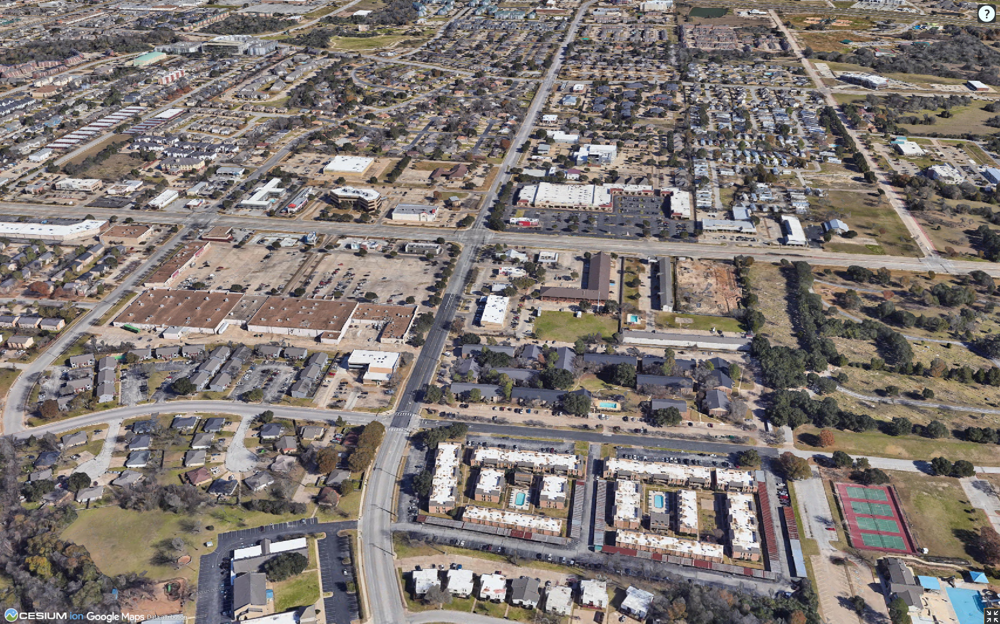

# V1 — Google Photorealistic 3D Tiles coverage, College Station TX

- **Date:** YYYY-MM-DD
- **Decides:** whether Phase 6 renders on Google photoreal tiles or falls
  back to Cesium OSM Buildings
- **Verdict:** COVERED | PARTIAL | NOT COVERED

## Method

Two independent checks, required to agree:

1. **Programmatic.** Descend the Google 3D Tiles tree toward four
   coordinates, recording the smallest geometric error reachable with
   real mesh content. Building-level detail is taken as ≤ 8 m, because
   a ~8 m tall suburban house cannot be represented by a larger error
   budget. Artifact: `data/processed/v1_tiles_coverage.json`.
2. **Visual.** Oblique camera at ~420 m over each point in CesiumJS,
   judged on façade geometry, volumetric canopy and roof detail.

The geometric-error threshold is **our heuristic, not a Google
definition.** Where the two checks disagree, the visual result governs
and the disagreement is recorded here.

## Results

| Point                   | Coordinates       | Min geometric error | Mesh nodes | Programmatic | Visual |
| ----------------------- | ----------------- | ------------------- | ---------- | ------------ | ------ |
| Town centre             | 30.6280, -96.3344 |                     |            |              |        |
| Residential subdivision | 30.6009, -96.3140 |                     |            |              |        |
| Texas A&M campus        | 30.6120, -96.3400 |                     |            |              |        |
| Commercial corridor     | 30.6280, -96.3100 |                     |            |              |        |



## Consequence

- **COVERED / PARTIAL over residential areas** → Phase 6 uses Google
  photoreal tiles. Attribution is mandatory and never suppressed.
- **NOT COVERED over residential areas** → Phase 6 falls back to Cesium
  OSM Buildings. §9 already requires the basemap to be swappable.

## Reproduction

```powershell
Copy-Item .env.example .env   # set REIN_GOOGLE_MAPS_API_KEY
uv run rein-verify-tiles
```
